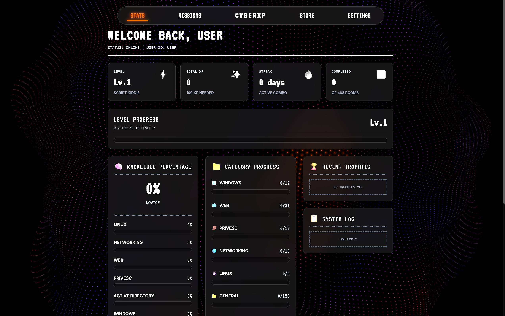
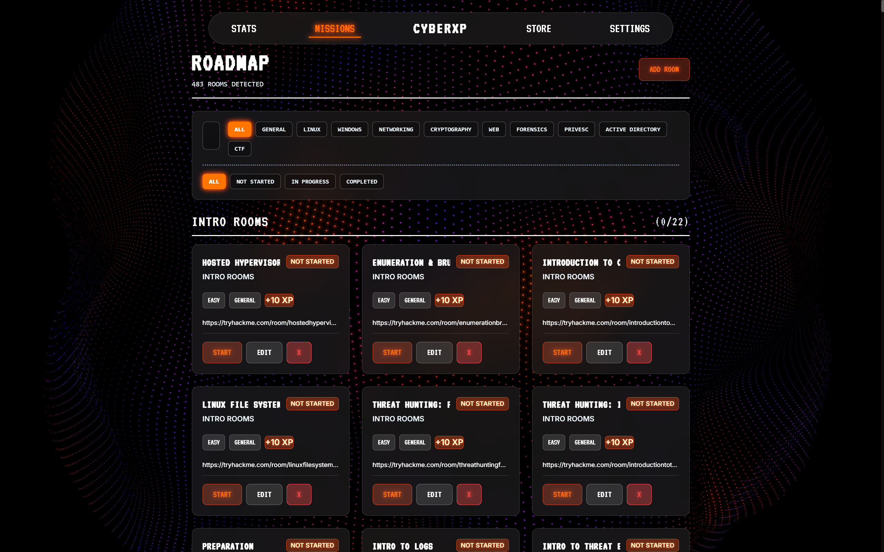
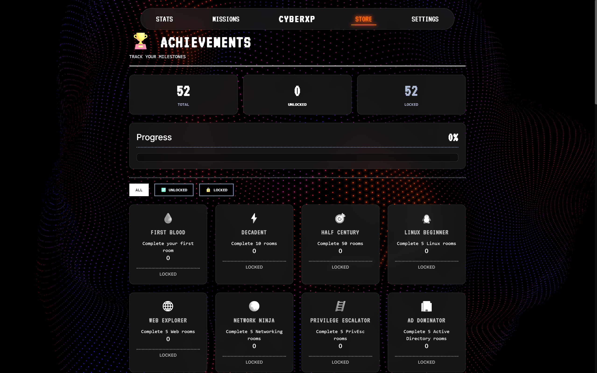

# 🛡️ CyberXP

### Duolingo for Cybersecurity

*   Track TryHackMe Progress
*   Earn XP
*   Unlock Achievements
*   Measure Internship Readiness (Knowledge Percentage)
*   Follow Guided Learning Paths

**Built with React, Express, and SQLite**

---

## 📸 Screenshots & Demos

### 🎬 Interactive Walkthrough (Demo)

*(To update this, record a GIF of the app in action and save it as `Screenshots/demo.gif`)*

### 📊 Dashboard & Stats


### 🛣️ Skill Tree Roadmap


### 🏆 Achievements (50+ Trophies)


---

## 🎮 Features

*   **⚡ XP & Leveling System**: Earn XP for completed rooms (Easy +10 XP, Medium +25 XP, Hard +50 XP) and level up dynamically.
*   **🔥 Streak Tracking**: Monitors daily activity and maintains active combos to motivate consistent practice.
*   **🏆 50+ Achievements**: Unlock unique, cybersecurity-themed milestone badges as you learn.
*   **🧠 Knowledge Percentage (Internship Readiness)**: Analyzes your skill distribution across domains (Linux, Windows, Web, Forensics, CTFs, etc.) to give a weighted readiness score.
*   **🎯 Smart Recommendations**: Suggests the next best room to attempt based on difficulty and path sequencing.
*   **🗺️ Interactive Roadmap**: Search, filter, and track rooms grouped by path and categories.
*   **📚 Cheat Sheet Library**: High-quality references for Linux, Nmap, Burp Suite, and SQL Injection with copy-to-clipboard buttons.
*   **🔮 Glassmorphism UI**: Premium visual aesthetics, featuring micro-animations and an interactive 3D Spline background.

---

## 🚀 Quick Start

### Prerequisites
*   **Node.js 22.5+** is required (as it uses the native `node:sqlite` module).

### 1. Setup & Installation
```bash
# Install server dependencies
cd server
npm install

# Install client dependencies
cd ../client
npm install
```

### 2. Configure Environment
Create a `.env` file in the `server` directory:
```ini
PORT=5000
```

### 3. Run the Application
Start both the backend server and frontend client.

#### Start the Server (Terminal 1)
```bash
cd server
npm run dev
```
*The database (`server/data/cyberxp.db`) will automatically initialize and seed itself on first run.*

#### Start the Client (Terminal 2)
```bash
cd client
npm run dev
```

*   **Frontend Access**: http://localhost:3000 (Local Dev) or https://sorapewnaldo.github.io/cyberxp/ (Live Production)
*   **Backend API Health**: http://localhost:5000/api/health (Local) or https://cyberxp-backend.onrender.com/api/health (Live)

---

## 🛣️ Roadmap & Project Structure

### Project File Map
```
├── server/          # Express API & SQLite Database
│   ├── config/      # SQLite DB configuration and seed checker
│   ├── controllers/ # Room, Achievement, Analytics, and Settings controllers
│   ├── data/        # Generated SQLite database file (cyberxp.db)
│   ├── routes/      # API endpoints
│   ├── scripts/     # Seeder scripts
│   └── utils/       # XP, leveling, and achievement engine
├── client/          # Vite + React Frontend
│   └── src/
│       ├── api/         # Axios instance configurations
│       ├── components/  # Glassmorphic UI components (Stats, Gauge, Cards)
│       ├── context/     # Global Settings & Profile context
│       ├── pages/       # Dashboard, Roadmap, Achievements, Analytics, Settings
│       └── utils/       # Level calculation helpers
```

### Future Milestones
*   [ ] Add customizable user profiles and custom avatars.
*   [ ] Integrate local storage caching to minimize Render free tier spin-down lag.
*   [ ] Add interactive custom quizzes to verify room completion knowledge.
*   [ ] Integrate automated syncing with TryHackMe public API profiles.

---

## 🤝 Credits

The list of TryHackMe rooms, paths, and URLs used in this application is seeded from:
*   **Repository**: [Hunterdii/tryhackme-free-rooms](https://github.com/Hunterdii/tryhackme-free-rooms) by [@Hunterdii](https://github.com/Hunterdii)

---

## 📄 License

This project is licensed under the MIT License.
